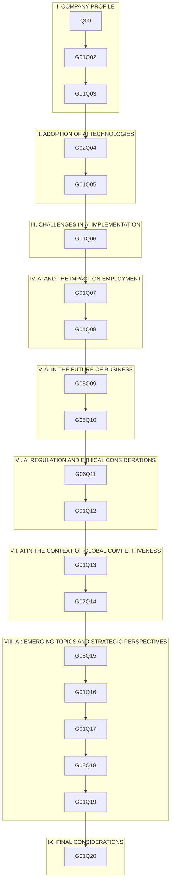

# Reconstructed question flow

## Evidence boundary

The sequence below is reconstructed from question codes and question-level timing fields in the paired exports. No native LimeSurvey design file was recovered. The exports do not preserve a complete, authoritative statement of mandatory settings, relevance equations, randomisation rules or page-level display conditions.

The 20 substantive questions appear in nine thematic groups and all 212 completed responses reached `lastpage == 20`. This supports a linear completed-case sequence but does not prove that every field was mandatory or that no display condition existed for partial attempts.

## Sequence

### I. COMPANY PROFILE

1. `Q00` — What is the size of your company?
1. `G01Q02` — In which sector does your company operate?
1. `G01Q03` — What is your role in the company?

### II. ADOPTION OF AI TECHNOLOGIES

1. `G02Q04` — How familiar are you with AI applications in business?
1. `G01Q05` — What are the main reasons why your company is considering or has considered adopting an AI solution?

### III. CHALLENGES IN AI IMPLEMENTATION

1. `G01Q06` — What are or have been the greatest barriers to AI adoption in your company?

### IV. AI AND THE IMPACT ON EMPLOYMENT

1. `G01Q07` — How do you think AI will affect employment dynamics in your sector?
1. `G04Q08` — What measures does or would your company take to prepare employees for AI integration?

### V. AI IN THE FUTURE OF BUSINESS

1. `G05Q09` — In which AI applications do you see the greatest potential for business value creation?
1. `G05Q10` — Do you think AI could produce explosive economic growth beyond traditional limits, stated in the source as a maximum of 12% of GDP?

### VI. AI REGULATION AND ETHICAL CONSIDERATIONS

1. `G06Q11` — Do you think AI should be more tightly regulated to prevent economic and ethical risks?
1. `G01Q12` — What is the greatest ethical concern regarding the use of AI in business?

### VII. AI IN THE CONTEXT OF GLOBAL COMPETITIVENESS

1. `G01Q13` — How competitive do you think Romania is in AI adoption compared with other European countries?
1. `G07Q14` — How should Romania position itself in the global AI market?

### VIII. AI: EMERGING TOPICS AND STRATEGIC PERSPECTIVES

1. `G08Q15` — How do you assess the environmental impact of AI technologies adopted or being adopted by your company?
1. `G01Q16` — What role do you think government incentives and support should play in accelerating AI adoption in your sector?
1. `G01Q17` — How do you think your company’s business model will change as AI integration intensifies over the next five years?
1. `G08Q18` — What new AI applications or innovations do you think will emerge in your sector over the next five years?
1. `G01Q19` — How do you intend to measure return on investment for your AI-related projects?

### IX. FINAL CONSIDERATIONS

1. `G01Q20` — Final comments and/or suggestions

## Machine-readable overview

## Unresolved reconstruction questions

- Whether every structured item was mandatory cannot be established from the CSV files alone.
- The exact placement and validation behaviour of comment boxes cannot be fully reconstructed.
- The wording of `G01Q19` conflicts with its one-field categorical export architecture.
- No native evidence was found for randomisation, quota logic, hidden relevance equations or branching conditions.
- The group-level timing fields are empty in the export while question-level timing fields are populated. They document order but not the complete user-interface configuration.
